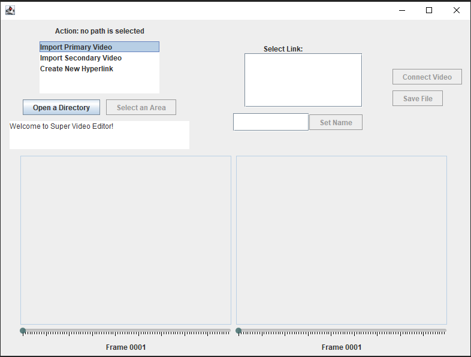
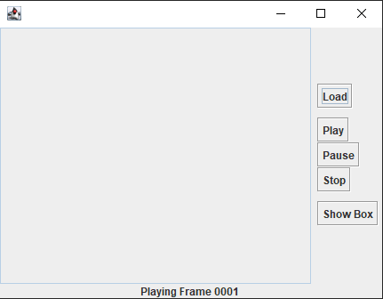

#### How to run it
- For 'Part1: Create a Hyper-Linking Video Authoring Tool'
```shell
javac ./GUI/AuthoringTool.java
java ./GUI/AuthoringTool
```

- For 'Part 2: Interactive video player'
```shell
javac ./GUI/VideoPlayer.java
java ./GUI/VideoPlayer
```
